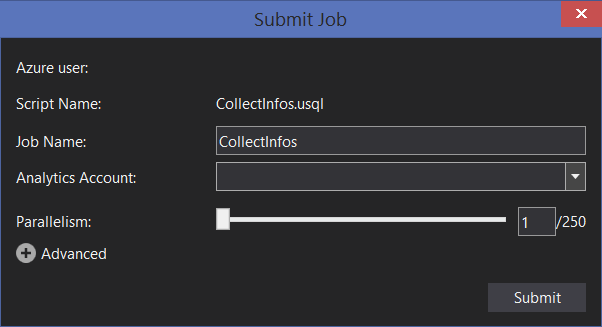
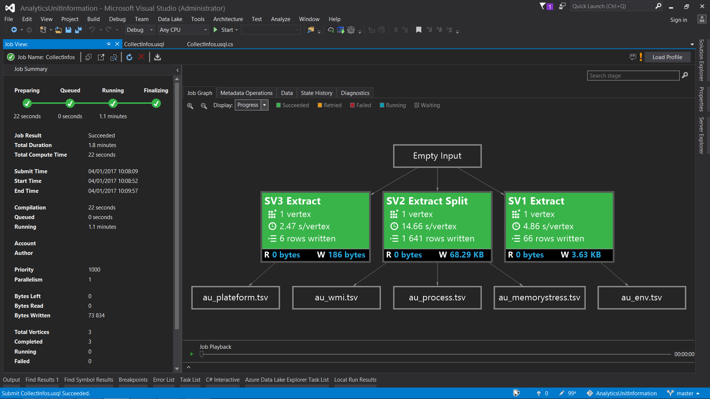

# Azure Data Lake Analytics Unit Informations

## Abstract

The purpose of this project is to get details on Azure Data Lake Analytics Unit by collecting system informations.

## Implementation

3 types of information is collected:

- Plateform informations, by using `System.Diagnostics.Environment` properties.
- Windows Management informations, by using `System.Management.ManagementObjectSearcher` (code-behind was used for this part).
- Environment variables, by using `System.Diagnostics.Environment.GetEnvironmentVariables` collection.

### Output

Each type of information is outputed in a dedicated tab-separated values files:

- au_plateform.tsv
- au_wmi.tsv
- au_env.tsv
- au_process.tsv

### Execution

We take the lowest degree of parallelism (1), as we are interested in collected informations for only one instance.

.

It takes less than a minute to execute the job.

## Informations

### Overview

At the time of script execution (20th december of 2016), one Azure Data Lake Analytics Unit runs on **Microsoft Windows Server 2012 R2 Datacenter** virtual machine, with **18 cores** (AMD64 architecture, clock speed of **2.40GHz**) and **2 GB** of RAM.

U-SQL scripts are probably executed by a process called **scopehost.exe**.

The low amount of reported memory (**2 GB**) is surprising. This is different from what was written in blog post [Understanding the ADL Analytics Unit](https://blogs.msdn.microsoft.com/azuredatalake/2016/10/12/understanding-adl-analytics-unit/):

> Currently, an AU is the equivalent of 2 CPU cores and 6 GB of RAM.

### Plateform

| name                   | value                           |
|------------------------|---------------------------------|
| OSVersion              | Microsoft Windows NT 6.2.9200.0 |
| ProcessorCount         | 18                              |
| Is64BitOperatingSystem | True                            |
| MachineName            | MICROSO-KH58PE5                 |
| UserDomainName         | MICROSO-KH58PE5                 |
| UserName               | SandboxUser                     |

### Windows Management

Windows Management informations can be viewed in [au_wmi.tsv](output/au_wmi.md) file.

### Environment Variables

Environment variables can be viewed in [au_env.tsv](output/au_env.md) file.

### Processes

Processes can be viewed in [au_process.tsv](output/au_process.md) file.
